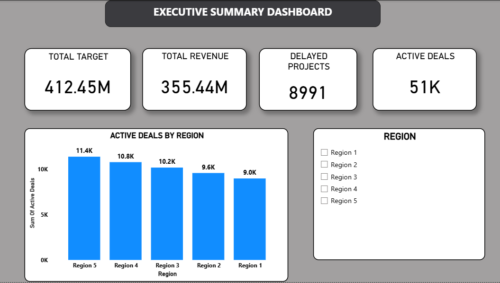
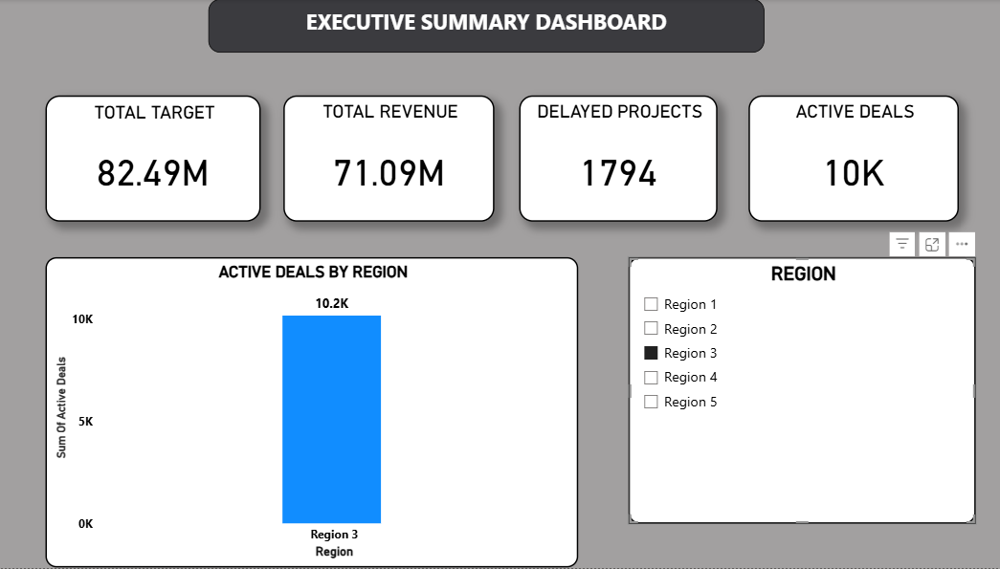

# Sales Performance Dashboard (Power BI)

This project is a simple sales analytics dashboard built using **Power BI**.
The goal of the dashboard is to provide a quick overview of sales performance and help understand how different regions are performing.

The dashboard focuses on key business metrics such as revenue, sales targets, delayed projects, and active deals. It also allows users to filter the data by region to analyze regional performance.

---

## Tools & Technologies Used

* **Power BI** – Data visualization and dashboard creation
* **SQL** – Data preparation and query writing
* **GitHub** – Project hosting and version control

---

## Dashboard Features

* Executive summary view of important sales KPIs
* Total revenue and sales target comparison
* Active deals across different regions
* Delayed project tracking
* Interactive **region filter** to explore regional performance

The dashboard is designed to give a **quick overview for decision-makers** while still allowing basic exploration of the data.

---

## Dashboard Preview





---

## Project Structure

```
powerbi-sales-dashboard
│
├── Create_Table.sql       # SQL script to create database tables
├── Insert_data.sql        # SQL script used to insert sample data
├── Sales_dashboard.sql    # Query used for analysis
├── Top_Region.sql         # Query to find top performing regions
│
├── Sales_Dashboard.pbix   # Power BI dashboard file
│
└── Screenshots
    ├── Dashboard_1.png
    └── Dashboard_2.png
```

---

## Key Insights from the Dashboard

* Some regions contribute significantly more active deals than others.
* Revenue currently does not fully meet the sales target.
* The regional filter helps quickly identify which regions are driving performance.

---

## About This Project

This project was created as a **portfolio project to practice data analysis and visualization using Power BI and SQL**.

The focus was on building a clean and easy-to-understand dashboard that summarizes important sales metrics.


